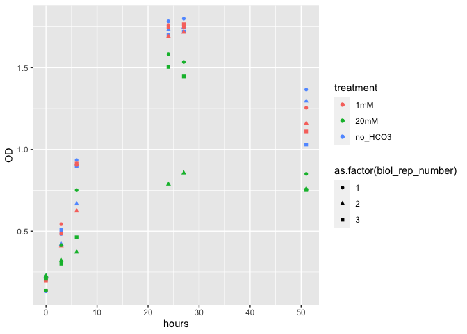

HCO3 pshB2 growth curves
================
2021-06-08

``` r
## Here follows script and figures for the analysis of growth curve data from 2021_03_31 where 
## I grew pshB2 H. modesticaldum mutant phototrophically in  medium PYE + 20uM FeSO4 under different NaHCO3-
## treatments. No HCO3-, 1mM and 20mM. Biological triplicates were used for each treatment.
```

``` r
##code to open and access datafile
## make excel datasheet into R Dataframe, do you have all packages required?
library(tidyverse)
```

    ## ── Attaching packages ─────────────────────────────────────── tidyverse 1.3.1 ──

    ## ✓ ggplot2 3.3.3     ✓ purrr   0.3.4
    ## ✓ tibble  3.1.2     ✓ dplyr   1.0.6
    ## ✓ tidyr   1.1.3     ✓ stringr 1.4.0
    ## ✓ readr   1.4.0     ✓ forcats 0.5.1

    ## ── Conflicts ────────────────────────────────────────── tidyverse_conflicts() ──
    ## x dplyr::filter() masks stats::filter()
    ## x dplyr::lag()    masks stats::lag()

``` r
##readxl is part of tidyverse, but when you load tidyverse after installation it doesnt add readxl by default
library(readxl)
##your data was preloaded in the Rproject directory, so then use read_excel fucntion to retrieve the data
HCO3_pshB2 <- read_excel("2021_03_31_pshB2_HCO3.xlsx")
##Make your first graph for fun
ggplot(data = HCO3_pshB2, aes(x = hours, y = OD, colour = treatment, shape = as.factor(biol_rep_number))) +
  geom_point()
```

<!-- -->

``` r
##The real challenge now is to interact and modify your dataframe in R so that you can plot all OD readings as a function of time(hours) vs OD for each HCO3 treatment
```
